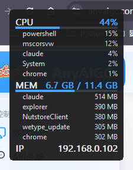

<p align="center">
  
</p>

# SysWidget

一个挂在桌面角落的小组件，实时显示 CPU、内存和本机 IP。想看是哪些程序在吃 CPU 或内存，还能展开各自占用前 5 的进程列表。

写它的初衷很简单：我想随时瞄一眼机器现在忙不忙，但又不想为这点事专门开个任务管理器，更不想装一个自己就占几百兆内存的"监控软件"——那也太讽刺了。所以这东西最较真的一点就是：**它自己得几乎不占资源**。实测挂在那儿常驻内存 1.8 MB 左右，CPU 基本是 0。

x64 和 ARM64 都是原生编译，两个架构的机器都能直接跑，不挑。


<!-- 截图占位：把一张实际运行的图放到 docs/preview.png 即可 -->

## 长什么样

就是一小块半透明的数字，默认停在屏幕左上角，可以拖到任何位置。两种显示风格：

- **极简数字**：只有数字，最干净
- **数字 + 条**：CPU / 内存后面多一根迷你进度条，一眼看出满没满

每一项都能单独开关。你要是这次只想看 IP，把 CPU 和内存关掉就行；下次只想盯 CPU，反过来关也一样。全靠右键菜单点一点，不用改配置文件。

## 主要功能

- CPU 占用、内存占用、本机内网 IP，实时刷新
- CPU / 内存可以各自展开**占用前 5 的进程**，带实时数值
- 每个显示项都能单独开 / 关
- 透明度可调（100% 到 30% 几档预设）
- 刷新间隔可调（0.5s ～ 5s）
- 窗口层级可选：不置顶、全局置顶、仅桌面（应用窗口覆盖组件，露出的桌面仍可见）
- 全屏时自动隐藏可通过菜单开关，游戏、全屏视频或幻灯片播放时不遮挡画面
- 鼠标点击穿透（点它就像点穿到底下的窗口）
- 开机自启（走的是当前用户的注册表 Run 项，不装服务、不碰系统）
- 托盘图标，所有开关都在右键菜单里
- 配置存在 exe 旁边的 `config.ini`，绿色便携，拷走就能用

## 怎么用

### 直接下载

去 [Releases 页面](../../releases/latest) 下载，按你的机器架构挑一个：

- Intel / AMD 的电脑 → `SysWidget-x64.exe`
- ARM 的电脑（骁龙本、部分 Surface 等）→ `SysWidget-arm64.exe`

双击就能跑，不用装任何运行库。第一次运行会在同目录生成一个 `config.ini`，你的设置都存这儿。

> 想校验下载完整性，可对照 Release 里的 `SHA256SUMS.txt`。

> 拿不准自己是哪个架构？任务管理器 →「性能」→ CPU，右下角会写型号；或者设置 →「系统」→「关于」里看「系统类型」。挑错了也没事，跑不起来换另一个就是。

### 操作

- **拖动**：在组件上按住左键拖就行
- **右键**：弹出菜单，所有选项都在这儿——显示哪些项、样式、透明度、刷新间隔、窗口层级、全屏隐藏、穿透、自启、退出
- **双击托盘图标**：快速显示 / 隐藏

开了「鼠标点击穿透」之后，组件就点不动了（点击会穿到下面的窗口）。想再改设置，从**托盘图标**右键进菜单就好。

关闭 CPU 或内存时，对应的前 5 进程也会关闭；重新开启主项后，需要再勾选前 5。手动隐藏组件后，退出全屏不会把它重新显示。

「全局置顶」在普通应用窗口上方显示；「仅桌面」位于桌面上方、应用窗口下方，应用没有覆盖的桌面区域仍可看到组件。配置兼容旧版 `topmost`，新增的 `window_mode` 优先。

## 自己编译

需要装了 **C++ 桌面开发**工作负载的 Visual Studio 或 Build Tools（要带 x64 和 ARM64 两套工具链）。然后：

```bat
build.bat            :: 两个架构都编
build.bat x64        :: 只编 x64
build.bat arm64      :: 只编 arm64
build.bat debug      :: 带调试符号
```

脚本会自己用 `vswhere` 找到 VS，按当前主机架构挑对交叉编译工具链，产物丢在 `dist\`。无论在 x64 还是 ARM64 的机器上跑这个脚本，都能把两个架构的 exe 都编出来。

## 它凭什么这么省

这是我最上心的部分，几个关键点：

- **纯 Win32 + GDI，C++ 写的**，没有 .NET、没有 Electron、没有任何运行时。整个程序就是一个一两百 KB 的 exe。
- **进程列表用 `NtQuerySystemInformation` 一次拿全**。一次系统调用就能拿到所有进程的 CPU 时间和内存，比反复开 Toolhelp 快照或者走 PDH 便宜太多——这也是"前 5 进程"这个功能几乎不花钱的原因。不展开进程列表时，这部分代码根本不会执行。
- **只采集你开着的项**。关掉的项连数据都不去取。
- **静态链接 CRT**（`/MT`），配合 `/O1 /Os`、`/GL /LTCG`、`/OPT:REF /OPT:ICF` 这些体积优先的开关，把 exe 压到最小。
- **定期把工作集还给系统**（`SetProcessWorkingSetSize`）。空闲的内存页交还给操作系统，任务管理器里显示的数字就一直很小；真要用到再换回来，对一个基本闲着的组件来说这几乎不会发生。
- 窗口是分层窗口 + 双缓冲绘制，不刷背景，所以不闪，重绘开销也低。

## 配置文件

大多数东西右键菜单里都能改，但你要是想直接手改 `config.ini` 也行：

```ini
[general]
mode=bars              ; minimal（极简数字）或 bars（数字+条）
opacity=92             ; 透明度 5–100
refresh_ms=1000        ; 刷新间隔（毫秒）500–5000
x=140                  ; 窗口位置
y=120
topmost=1              ; 兼容旧配置：1 为全局置顶，0 为不置顶
window_mode=global     ; normal（不置顶）、global（全局置顶）、desktop（仅桌面）
click_through=0        ; 鼠标点击穿透
autostart=0            ; 开机自启
hide_on_fullscreen=1   ; 全屏时自动隐藏

[show]                 ; 每项单独开关，1 显示 0 隐藏
cpu=1
mem=1
ip=1
cpu_top=1              ; 展开 CPU 前 5 进程
mem_top=1             ; 展开 内存 前 5 进程

[colors]               ; 十六进制颜色，不带 #
background=1c1c1e
text=e6e6e6
accent=4aa3ff          ; CPU/内存 数字和进度条的颜色
warn=ff9f43            ; 占用过高时的警示色
```

## 一些说明

- IP 显示的是本机内网 IPv4（第一块 up 状态的非回环网卡），不是公网 IP。
- 前 5 进程的 CPU 是按刷新间隔算的瞬时值，跟任务管理器的算法略有差别，快速跳变时数字对不上是正常的。
- 全屏隐藏依据前台窗口覆盖显示器的范围判断，并排除桌面、任务栏及普通带边框的最大化窗口。置顶不覆盖 Windows 安全桌面；桌面层级依赖 Explorer，第三方桌面替代程序可能影响显示。
- 只在 Windows 10 / 11 上测过。更老的系统没试，多半跑不起来。

## License

MIT，随便用。
